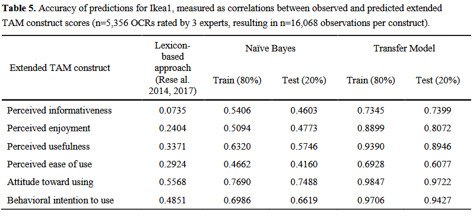
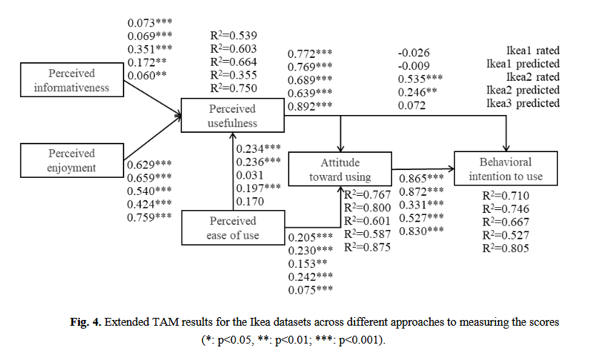

# Measuring technology acceptance over time using transfer models based on online customer reviews

Authors: Daniel Baier, Andreas Karasenko, Alexandra Rese

This respository accompanies the paper "Measuring technology acceptance over time using transfer models based on online customer reviews" published in the Journal
of Retailing and Consumer Services.

Online customer reviews (OCRs) are user-generated, semi-formal evaluations of products, services, or technologies. They usually consist of a timestamp, a star rating and, in many cases, a natural language comment that reflects perceived strengths and weaknesses. OCRs are easily accessible in large numbers on the Internet – for example, through app stores, electronic marketplaces, online shops, and review websites.
This paper presents new transfer models based on OCRs to measure acceptance. We train, test, and validate these transfer models using OCR samples and corresponding construct scores collected from expert raters or estimated from traditional surveys. From a management perspective, the new approach enhances former technology acceptance measurement because it enables a discussion of the evolution of acceptance over time. 

## Overview
This repository provides several scripts for replication purposes. For a quick overview see the following table

We split the repository into two parts. Part one was for the main empirical study revolving around estimating TAM construct scores using BERT-based models.
Part two focuses on estimating TAM construct scores using generative AI (GenAI) such as ChatGPT or Gemma.

Due to the review process and ongoing refinement process of the paper this repository is split into part one and part two (at time of submission and after revision).
These were conducted with roughly a year in-between.
As such they are incompatible (primarily because part one was run under windows and part two under wsl2).
Nonetheless each part offers codes for replicability which may also help other researchers conduct similar studies. 

|Task|Folder|
|---|---|
|TAM construct estimation using machine learning|[part1](./part1/)
|Synthetic data generation|[part2](./part2/)
|Images summarizing the key results|[img](./img/)

## datasets
For our evaluation we use online customer reviews scraped from the Google Play Store. See the image below.

## Results
The primary empirical results clearly show that modern BERT based approaches outperform traditional models like Naive Bayes and Lexicons.

Similarly common quality metrics such as cronbachs $\alpha$ show a good fit (see the images [validity1.png](./img/validity1.png) and [validity2.png](./img/validity2.png))
This effectively enables us to evaluate construct scores over time and validate our models in a conventional PLS-SEM.

We can see for both images that we can identify clear down-trends in the app ratings which, after manual inspection, reveals past issues.

Our predictions using machine learning are valid when used in a conventional PLS-SEM, further validating our approach.

## Citation
TBD

## Issues & Questions
Please use the issues on GitHub or notify me through my work-mail: andreas.karasenko@uni-bayreuth.de

Issues must contain codes + data for replicability, otherwise I can't help you.
Please note that the data is only available upon reasonable request